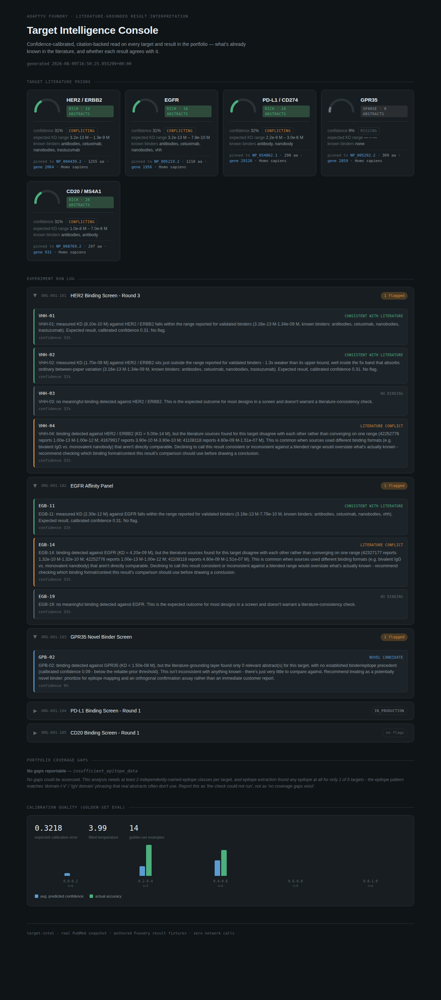

# Literature Grounding — `target-intel`

[](https://github.com/AMVamsi/adaptyv-target-intel/actions/workflows/ci.yml)
[](https://www.python.org/downloads/)
[](https://modelcontextprotocol.io/)
[](LICENSE)

> Built as a take-home for Adaptyv Bio's AI Engineer role. Runs on real
> PubMed literature, installs as a Claude Code plugin, and ships with the
> evals that tell you when it stops working.

**Is this binding result scientifically expected, novel, or implausible — given what's already published about the target?**

A result comes back from the lab: `VHH-04, KD = 50 fM` against HER2. The
curve fit is clean, R² is 0.998, and every numeric QC check passes.

Nothing in an assay-QC pipeline knows what 50 fM *means* for HER2. A
scientist who has read the binder literature does. This packages that
judgment as an installable skill and an MCP server, so it runs on every
result instead of only the ones someone happens to look at closely.

```
$ target-intel interpret 019d4a2b-3c5e-7890-a001-000000000001

HER2 / ERBB2  (019d4a2b-3c5e-7890-a001-000000000001)
  literature: rich | evidence: conflicting | confidence: 0.31 (calibrated)
  1 of 4 result(s) flagged for review

VHH-01  consistent_with_literature      (KD 8.10e-10 M — inside the core range)
VHH-02  consistent_with_literature      (KD 1.70e-09 M — 1.3x outside it, inside the 5x band)
VHH-03  no_binding

VHH-04  literature_conflict  [FLAG]
    binding detected against HER2 / ERBB2 (KD = 5.00e-14 M), but the
    literature sources found for this target disagree with each other rather
    than converging on one range (42252776 reports 1.00e-13 M-1.00e-12 M;
    41679917 reports 3.90e-10 M-3.90e-10 M; 41108118 reports 4.60e-09
    M-1.51e-07 M). This is common when sources used different binding
    formats (e.g. bivalent IgG vs. monovalent nanobody) that aren't directly
    comparable. Declining to call this result consistent or inconsistent
    against a blended range would overstate what's actually known -
    recommend checking which binding format/context this result's comparison
    should use before drawing a conclusion.
    citations: 42252776, 41679917, 41108118
```

Those are **real PMIDs**. Open
[41679917](https://pubmed.ncbi.nlm.nih.gov/41679917/) — trastuzumab at
0.39 nM — or [41108118](https://pubmed.ncbi.nlm.nih.gov/41108118/), SPR
KDs of 151 nM and 4.6 nM, and check them yourself.

**Note what it refused to do.** 50 fM is only ~2× below the tightest HER2
affinity anyone reports — and that report
([42252776](https://pubmed.ncbi.nlm.nih.gov/42252776/)) is a *multivalent*
construct, where sub-picomolar reflects avidity rather than 1:1 binding. So
the honest answer isn't "artifact"; it's "the sources you'd compare against
don't agree, and the tightest one isn't measuring the same thing your assay
is." A system that confidently called this an artifact would be guessing.
The two ordinary binders are still answered cleanly — the check stays quiet
where it has nothing to add.

---

## Why this, and not another API wrapper

Adaptyv's Foundry API, Python SDK and public MCP server are already mature —
rebuilding them adds nothing. The two closest skills in
[`adaptyvbio/protein-design-skills`](https://github.com/adaptyvbio/protein-design-skills)
were read in full, and they bracket this question without answering it:

| Skill | Question it answers | When |
|---|---|---|
| `protein-qc` | Is this design worth synthesizing? (pLDDT, ipTM, PAE) | **Before** the experiment, computational |
| `binding-characterization` | Is this curve trustworthy? (mass transport, NSB, regeneration) | **After** the experiment, assay physics |
| **`literature-grounding`** | **Is this number plausible for this target?** | **After** the experiment, domain knowledge |

A result can pass both of the existing checks and still be biologically
implausible. That gap is what this fills.

---

## Install

Nothing to configure — the real-literature snapshot ships in the repo, so it
runs end-to-end with no API key and no network.

```bash
git clone https://github.com/AMVamsi/adaptyv-target-intel && cd adaptyv-target-intel
pip install -e ".[dev]"
target-intel interpret 019d4a2b-3c5e-7890-a001-000000000001
```

**As a Claude Code plugin** (same mechanism as Adaptyv's own skills repo —
this repo is both a marketplace and a plugin):

```
/plugin marketplace add AMVamsi/adaptyv-target-intel
/plugin install literature-grounding@adaptyv-target-intel
```

(or `/plugin marketplace add .` from a local clone — the repo root is both
the marketplace and the plugin.)

Installing the plugin also registers the MCP server via `.mcp.json`, so the
seven tools below are available to Claude immediately. To wire the server up
by hand instead:

```bash
claude mcp add target-intel -- /absolute/path/to/adaptyv-target-intel/scripts/mcp_server.sh
```

That launcher is deliberate rather than incidental — it's the fix for two
real failures, both of which look like the server is broken when actually
the config is.

**`"command": "python"` doesn't work on most machines.** Debian and Ubuntu
ship `python3` and no `python`, so it dies with
`Executable not found in $PATH: "python"`. And where `python` *does*
resolve, it's the system interpreter, which doesn't have this project's
dependencies — so it starts and then fails on import.

**`"command": "${CLAUDE_PLUGIN_ROOT}/..."` doesn't work either.** That
variable is only substituted for servers installed *as a plugin*. A
project-scoped `.mcp.json` passes it through literally and the spawn
ENOENTs on a path containing a `$`.

So the config depends on no client-side substitution at all: `bash` is on
PATH everywhere, and the shell resolves the path at launch —
`$CLAUDE_PLUGIN_ROOT` when a plugin exports it, `$PWD` otherwise. The
launcher then picks the interpreter that actually has the dependencies
(repo venv → `$VIRTUAL_ENV` → `python3` → `python`), verifies the imports
before handing over, and if they're missing prints the exact `pip install`
line rather than an opaque "server exited".

A server that only starts when you happened to activate the right
virtualenv first isn't installable, it's a puzzle. `pytest` covers this:
`test_mcp_config_launches_without_client_side_variable_substitution`.

---

## The four surfaces

One engine (`TargetIntelligenceEngine`) behind all four — so a verdict is
computed exactly one way regardless of who asks: an agent, a person, a
container, or a browser.

**MCP server** — seven tools, for agents and the lab-wide assistant:

| Tool | Returns |
|---|---|
| `interpret_experiment_result` | A cited verdict per sequence in an experiment |
| `get_target_literature_context` | Known binders/epitopes, expected KD range, evidence level |
| `get_portfolio_coverage_gaps` | Targets whose known epitope diversity a single assay can't cover — plus an `analysis_status` saying whether an empty result means "no gaps" or "couldn't run" |
| `get_calibration_report` | Fitted temperature, ECE, per-bin accuracy, **and sample size** |
| `export_target_knowledge_graph_cypher` | Provenance-tagged triples as loadable Cypher |
| `list_targets` / `list_experiments` | Thin typed reads over the Foundry resources used here |

**CLI** — for humans and CI:

```bash
target-intel list-targets
target-intel context comp-her2-human
target-intel interpret <experiment-id>
target-intel coverage
target-intel kg comp-her2-human          # Neo4j-loadable Cypher
target-intel score                       # exact-span entity F1 vs. gold
target-intel eval                        # calibration + regression guards
python scripts/build_literature_snapshot.py   # refresh real literature from NCBI
```

**Deployed** — health-checked container plus Neo4j:

```bash
docker compose up -d
curl localhost:8002/health
python scripts/neo4j/load_graph.py --all      # provenance-tagged, idempotent
```

The same image serves stdio (Claude Code) or streamable-HTTP (containerised)
via `MCP_TRANSPORT`. `/health` returns **503 when degraded** — including when
the literature layer is in live mode and confidence is therefore
uncalibrated — so an orchestrator can act on the status code without parsing
the body.

**Dashboard** — one self-contained HTML file, zero deps, zero server, zero
network requests:

```bash
python -m target_intel.dashboard.generate_report
python -m target_intel.dashboard.build_dashboard   # -> dashboard.html
```

**Or just look at it: [amvamsi.github.io/adaptyv-target-intel](https://amvamsi.github.io/adaptyv-target-intel/)** —
the same file, published from `docs/index.html`. A test fails if that
published copy drifts from what the code currently produces, because a
dashboard showing output the repo no longer generates is worse than no
dashboard at all.



---

## How a verdict is produced

```
Foundry result ─┐
                ├─> compare ─> cited verdict
target literature ─> NER ─> 3-tier ensemble ─> calibrate ─┘
```

The extraction ensemble deliberately mirrors the structure of a validated
production pipeline (see [Provenance](#provenance)): a precise-but-narrow
tier, a loose-but-recall-heavy tier, and a semantic-plausibility tier, voting
into one raw score that is **then calibrated** — a raw ensemble vote is not a
probability and is never presented as one.

| Verdict | Meaning | Flags? |
|---|---|---|
| `consistent_with_literature` | KD within the range for validated binders, or within the 5x band around it | no |
| `outside_known_range_flag_artifact` | Far tighter than any precedent on a well-studied target | **yes** |
| `literature_conflict` | Independent sources disagree with each other | **yes** |
| `novel_candidate` | Binding found, but little precedent to compare against | **yes** (soft) |
| `weaker_than_typical` | Binds, but well below established binders | no |
| `qualitative_literature_only` | Binders known, no extractable numeric range | no |
| `no_binding` | No meaningful signal — the expected screen outcome | no |

### Two axes, not one

Confidence answers *how much* literature exists. It does **not** answer
whether the sources agree. A target can have two solid sources that describe
genuinely different affinity ranges — averaging them into one range
manufactures a consensus that was never there.

| Evidence level | Meaning |
|---|---|
| `verified` | ≥2 independent quantitative sources whose ranges agree |
| `claimed` | Exactly 1 quantitative source |
| `conflicting` | ≥2 sources whose ranges genuinely don't overlap |
| `missing` | No quantitative source found |

On the real snapshot, EGFR, PD-L1 and CD20 all come back `conflicting` —
their published affinities genuinely don't converge, usually because sources
measured different binding formats. The system cites the dissenting papers
and declines to pick a winner rather than averaging them into a consensus
nobody reported.

---

## Every target is pinned to a canonical protein

A catalog entry says `"HER2 / ERBB2"`. That's a display string, not an
identifier — it doesn't say which organism, which isoform, or which of the
dozen names the literature uses. Every claim below it ("these are HER2's
published binders") is only as trustworthy as the answer to *which protein,
exactly*.

So each target resolves against NCBI Gene at snapshot-build time:

| Target | Gene ID | RefSeq protein | Length | Organism |
|---|---|---|---|---|
| HER2 / ERBB2 | [2064](https://www.ncbi.nlm.nih.gov/gene/2064) | [NP_004439.2](https://www.ncbi.nlm.nih.gov/protein/NP_004439.2) | 1255 aa | *Homo sapiens* |
| EGFR | [1956](https://www.ncbi.nlm.nih.gov/gene/1956) | [NP_005219.2](https://www.ncbi.nlm.nih.gov/protein/NP_005219.2) | 1210 aa | *Homo sapiens* |
| PD-L1 / CD274 | [29126](https://www.ncbi.nlm.nih.gov/gene/29126) | [NP_054862.1](https://www.ncbi.nlm.nih.gov/protein/NP_054862.1) | 290 aa | *Homo sapiens* |
| CD20 / MS4A1 | [931](https://www.ncbi.nlm.nih.gov/gene/931) | [NP_068769.2](https://www.ncbi.nlm.nih.gov/protein/NP_068769.2) | 297 aa | *Homo sapiens* |
| GPR35 | [2859](https://www.ncbi.nlm.nih.gov/gene/2859) | [NP_005292.2](https://www.ncbi.nlm.nih.gov/protein/NP_005292.2) | 309 aa | *Homo sapiens* |

Two details that mattered:

- **Isoform choice is explicit.** ERBB2 links to 32 RefSeq proteins. The
  resolver filters to curated `NP_` records (not model-predicted `XP_`) and
  takes the lowest accession — the reference isoform. Capping the candidate
  list too early silently returned isoform *f* instead of the canonical one,
  which is the kind of bug that produces a confidently wrong identifier.
- **Aliases feed back into retrieval.** NCBI lists 13 for ERBB2 — HER2,
  CD340, c-ERB-2 — and the literature uses all of them. They're filtered
  before use: `NEU` and `NGL` are too short and match on coincidence, and
  `p185(erbB2)` contains parentheses PubMed reads as grouping.

---

## The literature is real

The default mode runs on a **frozen snapshot of real PubMed records** — 77
papers across 5 targets, real PMIDs, real journals, real extracted
affinities. Verdicts cite papers you can open.

```bash
python scripts/build_literature_snapshot.py   # rebuild from NCBI
```

The repo stores *derived* data — PMIDs, citation metadata, extracted spans,
and ≤200-char provenance excerpts. Full abstract text is cached under
`.cache/` (gitignored) rather than redistributed, and the script re-fetches
it. That's the same discipline the thesis pipeline uses: raw corpora
gitignored, processed splits reproducible from raw by script.

Three modes, descending realism: **`snapshot`** (default, real + frozen +
offline) · **`live`** (queries PubMed now; drifts between runs, confidence
uncalibrated) · **`demo`** (hand-written fixtures, retained only for
deterministic unit tests).

### What real data broke — and what fixed it

Switching off the hand-written corpus was not cosmetic. Three things failed
immediately, and each is a finding worth more than the demo it replaced:

| Real-data failure | Fix |
|---|---|
| **HER2's "expected range" spanned 1e-13 – 1.5e-7 M** — five orders of magnitude. The extractor was scooping up every number with molar units: IC50s, working concentrations, doses. | Affinity **qualification**: a value counts only when the surrounding clause presents it as a dissociation constant, and is rejected outright when an `IC50`/`EC50`/concentration cue sits closer. |
| **Even correctly-extracted affinities span orders of magnitude** — real HER2 binders run from engineered sub-picomolar constructs to 151 nM starting clones. Both extremes are genuine, so no amount of better extraction narrows the envelope. | Report a **robust core**: log-space interquartile range (affinities are log-normal). HER2 → typical **1 pM – 3.9 nM**, envelope still shown for transparency, never used for a verdict. |
| **Every target came back `conflicting`** — the pairwise agreement test flags if *any* two sources disagree, and across enough real papers some pair always does. | **Hybrid test**: pairwise below 4 sources (where it's the only thing that catches a genuine 100× disagreement), consensus-against-core above it (where one outlier shouldn't condemn the set). |

A fourth, subtler one: density was being read off the calibrated
confidence, which labelled **every** real target `sparse` — HER2 included,
with 19 papers behind it. Density now counts quantitative sources.

**Calibration was refit on the corpus actually served.** A temperature fit
on demo text and applied to real text reported HER2 at confidence 0.00 —
a target with four agreeing quantitative sources. The number wasn't wrong,
it was meaningless, because it answered a question about a different
distribution. Refit on real data: **T = 3.99, ECE 0.322 (n=14)**, up from
0.224 on the easier hand-written corpus (temperature 0.44). That degradation is the honest cost
of real data, and it's reported rather than hidden.

### What is still synthetic, and why

**The experiment results.** There is no Foundry API token, so KD values in
`sdk/fixtures/` are authored — designed test cases, one per verdict path,
chosen to probe the *real* literature priors. `VHH-04` at 50 fM is flagged
because it's ~20× tighter than the 25th percentile of genuinely published
HER2 affinities. The prior is real; the probe is synthetic and labelled.

---

## Honest reporting

The design rule throughout: **a number that can't be justified says so.**

- **Calibration declares its own validity.** The temperature is fit on
  whichever corpus is being served — `snapshot` and `demo` each get their
  own fit, because a temperature fit on one is meaningless applied to the
  other. Live mode can't be fit ahead of time, since its text changes per
  query, so every prior is stamped `calibrated` or `uncalibrated_live`, and
  live-mode verdicts carry the caveat *in the rationale text* — not just in
  a field nobody reads.
- **ECE never ships without its sample size.** `get_calibration_report`
  returns `n_golden_examples` alongside the error. Current measured values on the **real** corpus:
  **temperature 3.99, ECE 0.322, n = 14** (0.224 on the easier hand-written
  corpus — real literature is harder, and the number moves accordingly). Fourteen is illustrative scale,
  not production scale, and the number is quoted that way everywhere.
- **Synthetic vs. real is labelled everywhere.** Literature is real (real
  PMIDs). Experiment results are authored test cases, and say so. The
  hand-written `corpus.py` survives only as unit-test fixtures, tagged
  `DEMO####` so it can never be mistaken for a citation.
- **The NER is a documented stand-in — and it is measured.** A
  rule/gazetteer extractor plays the architectural role a fine-tuned model
  would; `extract_entities()` is the single interface a real model would
  replace. Rather than leave "stand-in" as an unfalsifiable claim, it is
  scored against a hand-labeled gold set with the same exact-span rule the
  thesis pipeline uses (`target-intel score`):

  | Split | P | R | F1 | spans |
  |---|---|---|---|---|
  | `demo_corpus` (in-domain) | 1.000 | 1.000 | **1.000** | 35 |
  | `heldout_realistic` | 1.000 | 0.850 | **0.919** | 20 |
  | overall | 1.000 | 0.946 | 0.972 | 55 |

  **Read the first row as a ceiling, not a result.** The gazetteer was
  written against that text, so 1.000 measures internal consistency, not
  generalization. The held-out row is the honest number, and the gap is
  concentrated in exactly one place: `BINDER_NAMED` recall is **0.700**,
  because the held-out split deliberately contains binders the gazetteer
  doesn't list (rituximab, bevacizumab, obinutuzumab). A dictionary cannot
  know a name that isn't in it — which is the measured argument for
  replacing it with a trained model, rather than an assumed one.

### Known limitations

- **Epitope recall on real text is weak — and it has a visible consequence.**
  The epitope pattern matches `domain I–V` / `IgV domain`, which real
  abstracts often phrase differently. This is why well-studied targets score
  low in real-literature mode: the tier-1 hit requires an epitope, so it
  rarely fires. It also means **`target-intel coverage` /
  `get_portfolio_coverage_gaps` returns an empty list on the shipped
  snapshot** — one epitope is found across all five targets, below the
  two-class threshold the analysis needs. The logic is unit-tested against
  text that does name multiple classes; on the real corpus it currently has
  nothing to report, and returns nothing rather than manufacturing a
  finding. The tool says so in an `analysis_status` field —
  `insufficient_epitope_data`, not an unexplained empty list — because an
  agent handed a bare `[]` will tell a scientist their coverage is fine.
  Fixing the underlying recall means a trained model, not more regex.
- **The live calibrator is a placeholder.** Making live-mode confidence
  meaningful needs a golden set labeled on real abstracts, which this
  doesn't have. Hence the explicit `uncalibrated_live` stamp rather than a
  number presented with false authority.
- **`MockTransport` is read-only** and implements no pagination or
  server-side filtering; the real API's `filter=` s-expression syntax is not
  emulated.
- **The Neo4j load path is unverified against a live database.** Docker
  could not be started in the build environment. The loader's logic —
  idempotent merges, label validation, provenance QC — is unit-tested with a
  fake session, and `--dry-run` prints the exact Cypher, but nobody has
  watched it write to a real server.
- **`5.71 ± 3.89 nM` loses its central value.** The unit attaches to the
  error term, so the extractor sees only `3.89 nM` — now correctly rejected
  as an uncertainty rather than recorded as an affinity, but the real
  measurement is lost with it. A parser that understands `value ± error unit`
  would recover it.
- **Cross-target contamination.** A HER2 query returns papers that also
  discuss cetuximab (anti-EGFR); affinities are linked to the abstract, not
  to the specific protein they describe. Fixing this properly is relation
  extraction, which is what the thesis's fine-tuned classifier does.
- **The gold set is 22 sentences / 55 spans.** Enough to catch a regression
  and to quantify the gazetteer's recall gap; not enough to claim a precise
  F1. Reported with its size everywhere.
- **Coverage analysis can't identify epitopes.** It flags when the
  literature shows enough epitope diversity that epitope-binning is worth
  running. It does not and cannot claim which epitope a given sequence hit.

---

## Tests

```bash
pytest                                   # 159 tests, no network, no API key, ~10s
ruff check src tests scripts evals       # clean; runs in CI ahead of the tests
```

The suite is a clean-clone run: `pythonpath = ["src"]` in `pyproject.toml`
means it works without `pip install -e .` and without exporting anything.
It passes on **both mcp 1.x and mcp 2.x** — the SDK renamed its server class
between generations, so the server imports whichever is installed rather
than forcing a pin on whoever installs this.

Coverage worth pointing at:

- **`test_mcp_protocol.py`** launches the server as a real subprocess over
  stdio and drives it with a real `ClientSession` — initialize, `tools/list`,
  `tools/call`, parse the payload back. That's the exact path Claude Code
  takes when it reads `.mcp.json`, so it covers the install story too.
  Direct function calls pass even when the server can't start; this is the
  test that catches that.
- **`test_ner_real_notation.py`** pins extraction against the notation real
  abstracts use (`KD = 2.3 nM`), including two false positives observed in
  live PubMed output: `0.8 nm` is a particle diameter, not an affinity, and
  `2 M NaCl` is a buffer.
- **`test_pubmed_live_path.py`** parses a real, unedited EFetch response
  saved to `tests/data/`, so the live path's parsing is verified offline. It
  pins that abstracts keep their **own** PMID — pairing by list position
  silently mis-cites every record after the first one with no abstract.
- **`test_calibration_status.py`** pins that the caveat reaches the rationale
  and that it never changes a verdict label.
- **`test_scorer.py`** checks the scoring arithmetic where it's easy to be
  wrong in a flattering direction (partial overlap is a miss; a right span
  with the wrong type counts as both FP and FN), and asserts the gold set's
  own integrity — a mistyped label fails loudly rather than shifting every
  subsequent span and quietly moving the F1.
- **`test_neo4j_loader.py`** verifies writes are idempotent `MERGE`s,
  interpolated Cypher identifiers are allowlisted before reaching a query
  string, and every `BINDS` edge carries PMID provenance.
- **`test_health.py`** pins that live mode reports **degraded rather than
  ok**, and that the check never constructs a network client.

`evals/run_evals.py` adds deterministic regression guards independent of the
calibration numbers — HER2 must produce a tier-1 hit, GPR35 must score below
HER2, a zero-abstract target must degrade to 0.0, ECE must stay under its
guard threshold.

---

## Live mode

Two live paths exist. **One has been run against the real service; one has
not**, and they're labelled accordingly rather than described together:

```bash
target-intel context comp-her2-human --live-literature   # real PubMed — run, verified
FOUNDRY_API_TOKEN=... target-intel list-targets --live   # real Foundry API — never run, no token
```

Live PubMed retrieval was verified end-to-end: for HER2 it returns 20 real
abstracts and extracts real binders (trastuzumab, cetuximab, nanobodies)
with real PMIDs. Two things had to be fixed to get there, both documented in
the code:

1. **Query precision.** The obvious query — gene AND (binding OR affinity OR
   antibody) — returned 18 ERBB2 abstracts with **zero** extractable
   affinities, because "antibody" matches every ADC and clinical-outcome
   paper. Requiring a measurement term as its own AND-ed clause took that to
   4/20 abstracts with usable affinities and 19/20 mentioning a binder.
2. **Notation.** The demo corpus writes "5 nanomolar"; real abstracts write
   "KD = 2.3 nM". Symbol units are matched **case-sensitively** because `nm`
   is nanometres and `nM` is nanomolar.

The Foundry live path is coded against the documented public API but has not
been exercised against a real account — no token. That is a gap, stated
plainly rather than papered over.

---

## Provenance

The architecture — retrieval → NER → multi-tier relation extraction →
temperature calibration → provenance-tagged knowledge graph → cited output —
is carried over from an MSc thesis pipeline (ZHAW Wädenswil) that runs it at
production scale: 5,165 PubMed articles, NER micro-F1 0.884, relation
extraction micro-F1 0.815, ECE 0.038 post-calibration, 33,246 triples in a
deployed Neo4j graph behind a health-checked MCP server.

Four components are **ported directly** from that codebase, adapted to this
domain:

| Ported | From | Why it matters here |
|---|---|---|
| Exact-span entity scorer | `module3_ner/stage5_evaluation/f1_scorer.py` | Turns "documented stand-in" into a measured number |
| `/health` payload + Compose healthchecks | `mcp_server/health.py`, `docker-compose.yml` | Makes it deployable, not just runnable |
| Neo4j loader w/ provenance + QC gate | `scripts/neo4j/load_defensible_subset.py` | The graph goes somewhere instead of being a string |
| Temperature scaling + binned ECE | `module3_ner/stage4_inference/calibration.py` | Confidence that declares its own validity |

**Scale figures belong to the thesis and are not claimed for this
prototype.** This project's own measured numbers — held-out entity F1 0.919
on n=20 spans, ECE 0.322 on 14 examples — are reported separately, with their
sample sizes, above. No model weights or datasets are copied.

---

## Further reading

- [`docs/ANALYSIS.md`](docs/ANALYSIS.md) — full technical write-up: what was
  built, what real data broke, and every limitation found.
- [`skills/literature-grounding/SKILL.md`](skills/literature-grounding/SKILL.md)
  — the skill itself, in Adaptyv's own SKILL.md convention.

---

## License

**Proprietary — © 2026 Mohan Vamsi Adluru. All rights reserved.**

Published to be read and evaluated, not reused. The [LICENSE](LICENSE) grants
anyone the right to clone, run and study it for evaluation — Adaptyv Bio
explicitly and without needing to ask — and reserves everything else. It's
temporary: this moves to MIT once the evaluation it was written for is over.
